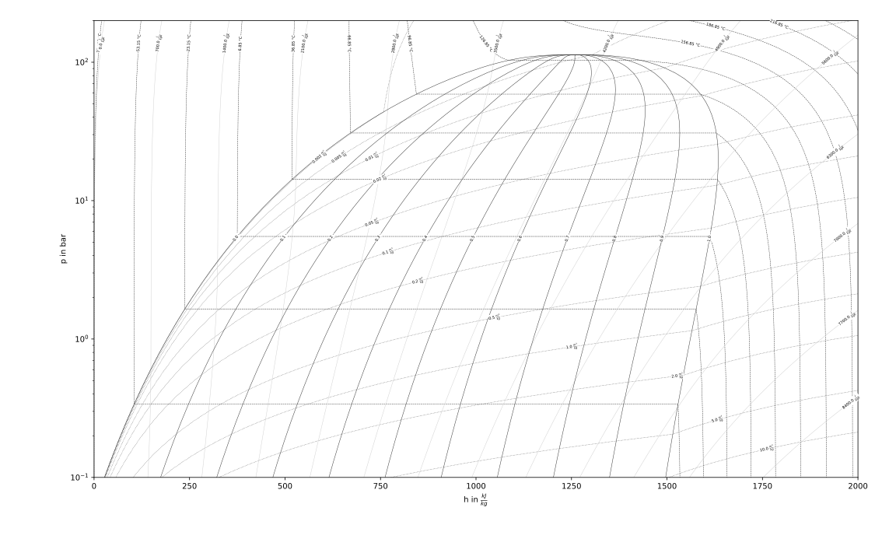
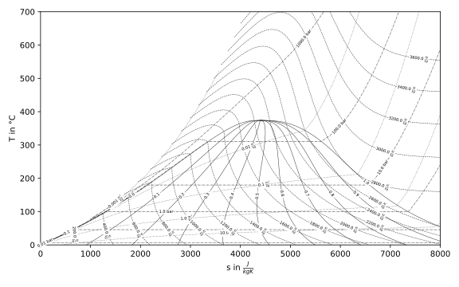

=======================
Fluid Property Diagrams
=======================

Create custom and beautiful Fluid Property Diagrams with fluprodia. The package
implements fluid property data from CoolProp [1]_. Plotting is handled by
matplotlib [2]_, all calculations are performed with numpy [3]_.
The list of fluids available can be found at
`CoolProp <http://www.coolprop.org/fluid_properties/PurePseudoPure.html#list-of-fluids>`_.

Installation and Usage
======================

.. code-block:: bash

    pip install fluprodia

.. code-block:: python

    from fluprodia import FluidPropertyDiagram

    diagram = FluidPropertyDiagram(fluid='NH3')
    diagram.calc_isolines()
    diagram.set_limits(x_min=0, x_max=7000, y_min=200, y_max=450)
    diagram.draw_isolines(diagram_type='Ts')
    diagram.save('Ts_Diagramm.pdf')

Citation
========

Every version of fluprodia is archived at zenodo. You can cite the latest or
a specific version. For citation info and more details please go to the
`zenodo entry <>`_ of fluprodia.

References
==========

This software depends on the packages CoolProp, matplolib and numpy.

.. [1] Bell, I., Wronski, J., Quoilin, S. and Lemort, V., 2014. Pure and Pseudo-pure Fluid Thermophysical Property Evaluation and the Open-Source Thermophysical Property Library CoolProp. *Industrial & Engineering Chemistry Research*, 53(6), pp. 2498-2508.
.. [2] Hunter, J., 2007. Matplotlib: A 2D Graphics Environment. *Computing in Science & Engineering*, 9(3), pp. 90-95.
.. [3] van der Walt, S., Colbert, S. and Varoquaux, G., 2011. The NumPy Array: A Structure for Efficient Numerical Computation. *Computing in Science & Engineering*, 13(2), pp. 22-30.

License
=======
.. include:: ../LICENSE
