=====
Usage
=====

Introduction
^^^^^^^^^^^^

After installation of fluprodia you can easily create fluid property diagrams
for all pure and pseudo-pure fluids from the CoolProp fluid property database.
For a list of available fluids please refer to the online documentation of
`CoolProp <http://www.coolprop.org/fluid_properties/PurePseudoPure.html#list-of-fluids>`_.

In order to start, import the package and create an object of the class
:py:class:`fluprodia.fluid_property_diagram.FluidPropertyDiagram` by passing
the alias of the fluid. After that, it is possible to specify a unit system
for all fluid properties available with the
:py:meth:`fluprodia.fluid_property_diagram.FluidPropertyDiagram.set_unit_system`
method. The fluid properties available are:

- pressure :code:`p`
- specific enthalpy :code:`h`
- specific entropy :code:`s`
- specific volume :code:`v`
- temperature :code:`T`
- vapor mass fraction :code:`Q`

.. code-block:: python

    >>> from fluprodia import FluidPropertyDiagram
    >>> import numpy as np
    >>> import matplotlib.pyplot as plt
    >>> diagram = FluidPropertyDiagram('R290')
    >>> diagram.set_unit_system(T='°C', p='bar', h='kJ/kg')

After that, you can use the default isolines or specify your own lines by
using the
:py:meth:`fluprodia.fluid_property_diagram.FluidPropertyDiagram.set_isolines`
method. If you do not specify custom isolines, generic isolines will be used
instead. Next step is to calculate the isolines, drawing them and exporting the
diagram in your favorite format. The formats available are the matplotlib file
formats for figures. You will also need to specify the limits in order to
determine the view. Also, different diagrams will have different value ranges
for their x- and y-axes.

.. code-block:: python

    >>> iso_T = np.arange(-75, 151, 25)
    >>> diagram.set_isolines(T=iso_T)
    >>> diagram.calc_isolines()
    >>> fig, ax = plt.subplots(1, figsize=(16, 10))
    >>> diagram.draw_isolines(fig, ax, 'Ts', x_min=500, x_max=3000, y_min=-50, y_max=150)
    >>> plt.tight_layout()
    >>> fig.savefig('Ts_diagram.svg')

.. figure:: reference/_images/Ts_diagram.svg
    :align: center
    :figclass: only-light

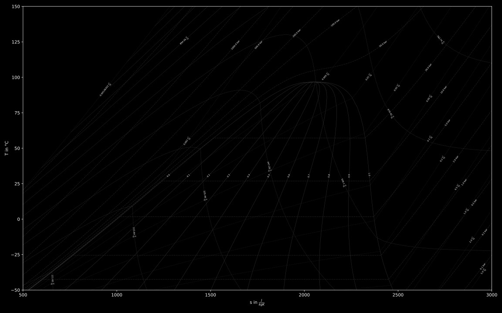

As all fluid properties will be stored in the object referenced by
:code:`diagram`, it is possible to change the diagram type and export a new
diagram without recalculating the isolines. Only if you wish to draw a
different set of isolines unlike specified in the :code:`set_isolines()` method
call, you need to recalculate the isolines.

.. code-block:: python

    >>> fig, ax = plt.subplots(1, figsize=(16, 10))
    >>> diagram.draw_isolines(fig, ax, 'logph', x_min=0, x_max=750, y_min=1e-1, y_max=1e2)
    >>> plt.tight_layout()
    >>> fig.savefig('logph_diagram.svg')

.. figure:: reference/_images/logph_diagram.svg
    :align: center
    :figclass: only-light

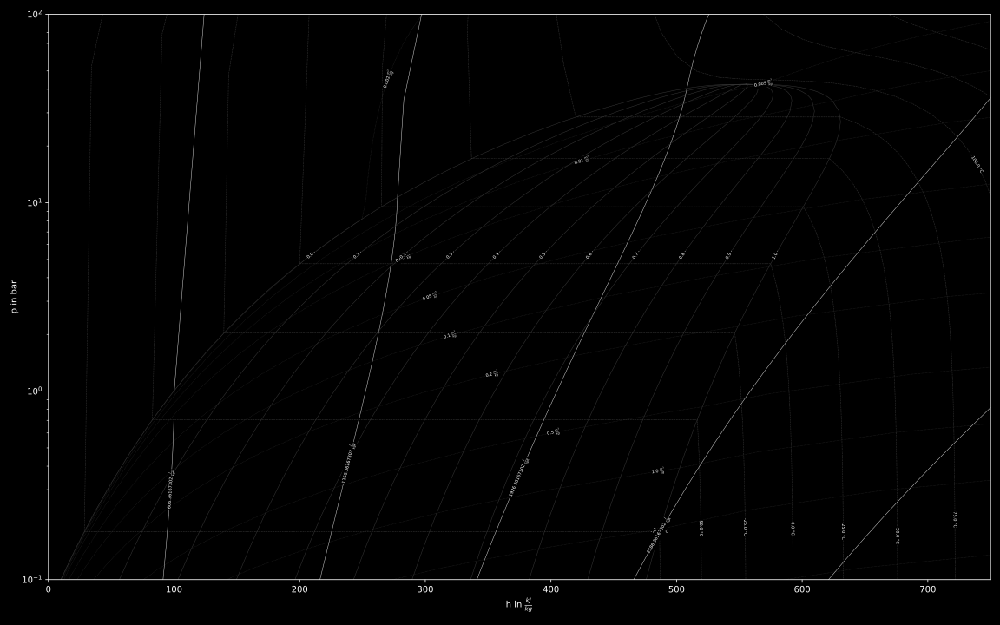

All available diagram types can be displayed by printing the following line.

.. code-block:: python

    >>> list(diagram.supported_diagrams.keys())
    ['Ts', 'hs', 'logph', 'Th', 'plogv']

You can also change the back-end of CoolProp, e.g. to use REFPROP:

.. code-block:: python

    diagram = FluidPropertyDiagram(fluid='R290', backend='REFPROP')

Customizing the Display
^^^^^^^^^^^^^^^^^^^^^^^

Customization is possible regarding

- generation of isolines only within a specific region of the fluid,
- the isovalues of the isolines,
- the isolines to be displayed,
- the linestyle of the isolines and
- the position of the isolines' labels.

Isolines only within a specific region
**************************************

By default, every isoline is generated for the complete value space of the
fluid properties, that means from minimum to maximum temperature, or from
minimum to maximum pressure, density, etc.. It is possible to make a
sub-selection of a temperature range. This automatically assigns values for
all isolines within that range. The advantage of this implementation is that
it can reduce the overall amount of isolines to be calculated, and that the
amount of points per line is higher in the specified subsection, because all
points are distributed on the full range otherwise.

.. code-block:: python

    >>> T_min = -75
    >>> T_max = 150
    >>> diagram.set_isolines_subcritical(T_min, T_max)
    >>> diagram.calc_isolines()

.. note::

    This feature is new in version 3.4. It is likely, that it will be refined,
    and more methods for other sections (transcritical and supercritical) are
    planned.

.. code-block:: python

    >>> fig, ax = plt.subplots(1, figsize=(16, 10))
    >>> diagram.draw_isolines(fig, ax, 'logph', x_min=0, x_max=750, y_min=1e-1, y_max=1e2)
    >>> plt.tight_layout()
    >>> fig.savefig('logph_R290_isolines_subsection.svg')
    >>> fig, ax = plt.subplots(1, figsize=(16, 10))
    >>> diagram.draw_isolines(fig, ax, 'Ts', x_min=500, x_max=3000, y_min=-50, y_max=150)
    >>> plt.tight_layout()
    >>> fig.savefig('Ts_R290_isolines_subsection.svg')

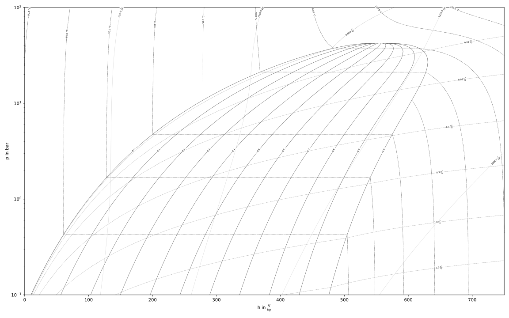

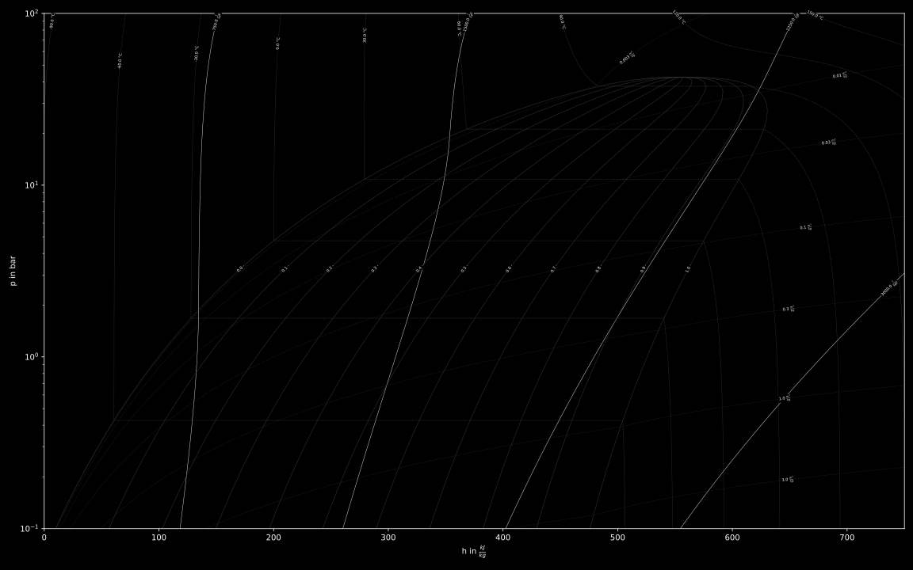

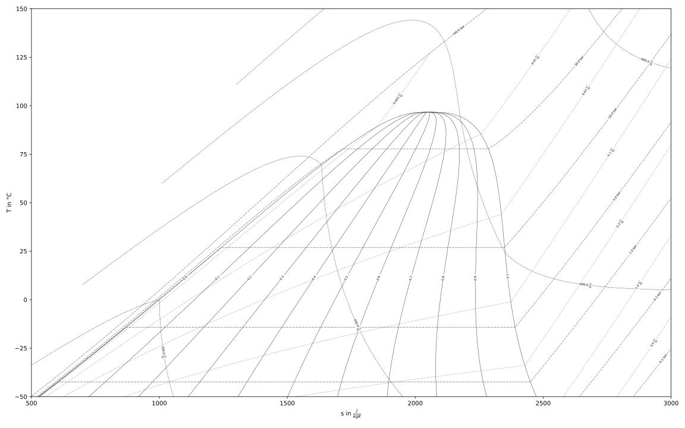

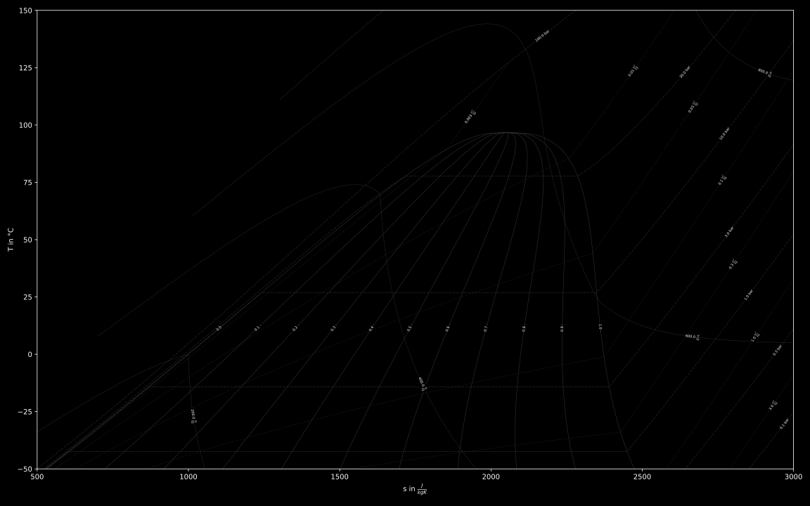

Isoline values available
************************

As already mentioned, you can set the isolines for your diagram like this. All
isolines you specify are available for drawing the diagram later. Therefore,
the more values you specify, the more lines can be displayed. Also, the
computation time will rise.

Still, it might be useful to specify a lot of values. E.g., if we want to
create a full view of a logph diagram for R290 and a zoomed view in the two
phase region with lines of constant vapor mass fraction for every 2.5 % and
lines of constant temperature every 5 K.

.. code-block:: python

    >>> T = np.arange(-75, 151, 5)
    >>> Q = np.linspace(0, 1, 41)
    >>> diagram.set_isolines(T=T, Q=Q)
    >>> diagram.calc_isolines()

The following sections shows how to select from all isolines available.

Lines displayed and Linestyle
*****************************

As we do not want to display all values for temperature and vapor mass fraction
for the full view diagram, we specify the values to be displayed for these
properties. This is done by using the :code:`isoline_data` property, which must
be a dictionary holding the required information.

.. code-block:: python

    >>> fig, ax = plt.subplots(1, figsize=(16, 10))
    >>> mydata = {
    ...    'Q': {'values': np.linspace(0, 1, 11)},
    ...    'T': {'values': np.arange(-75, 151, 25)}
    ... }
    >>> diagram.draw_isolines(fig, ax, 'logph', isoline_data=mydata, x_min=0, x_max=750, y_min=1e-1, y_max=1e2)
    >>> plt.tight_layout()
    >>> fig.savefig('logph_R290_full.svg')

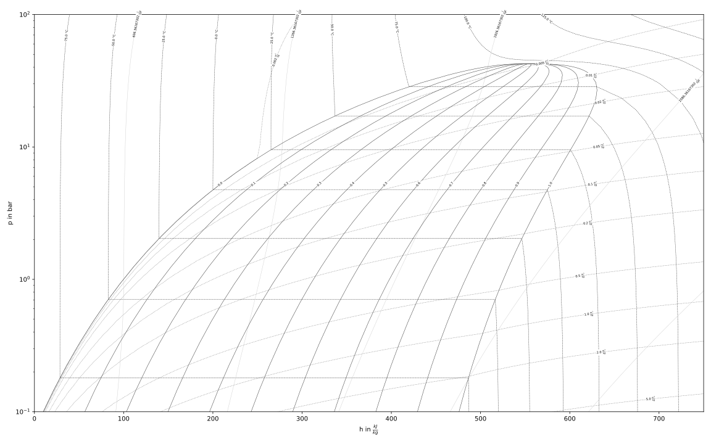

Now, for the zoomed diagram we want the full temperature and vapor mass
fraction data. At the same time, you might want to change the color or the
linestyle of an isoline. For this example, we will color the lines of constant
temperature in red. Additionally, the lines of constant specific volume should
not be displayed at all. This can be done by passing an empty list or an empty
numpy array.

.. code-block:: python

    >>> fig, ax = plt.subplots(1, figsize=(16, 10))
    >>> mydata = {
    ...     'T': {
    ...         'style': {'color': '#ff0000'},
    ...         'values': T
    ...     },
    ...     'v': {'values': np.array([])}
    ... }
    >>> diagram.draw_isolines(fig, ax, 'logph', isoline_data=mydata, x_min=300, x_max=600, y_min=1, y_max=1e2)
    >>> plt.tight_layout()
    >>> fig.savefig('logph_R290_zoomed.svg')

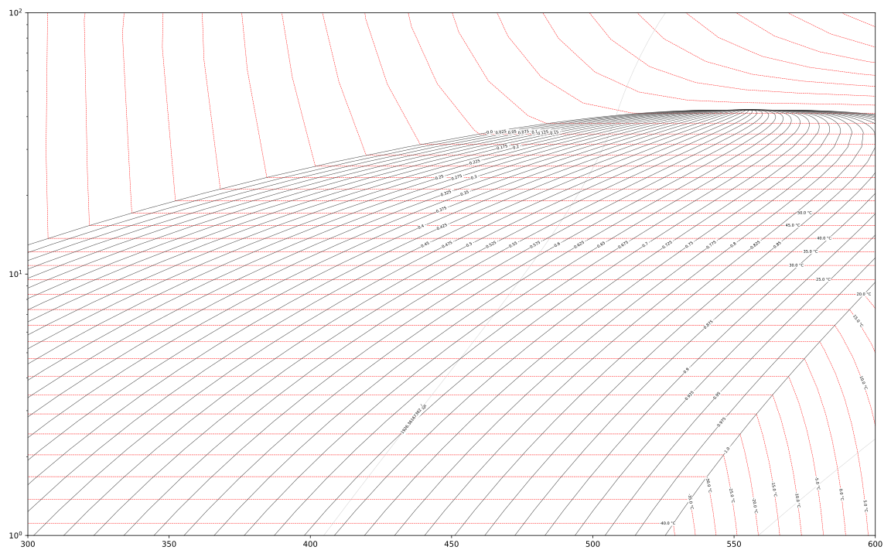

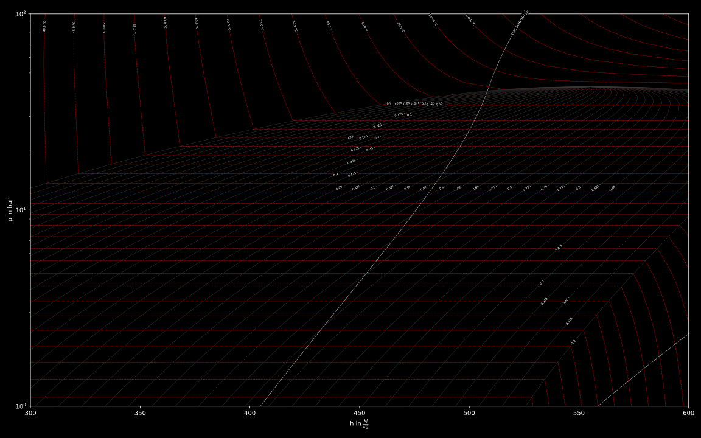

.. note::

    For changing the style of a specific isoline pass the respective keyword
    and value pairs in a dictionary. The keywords available are the keywords
    of a :code:`matplotlib.lines.Line2D` object. See
    https://matplotlib.org/stable/api/_as_gen/matplotlib.lines.Line2D.html
    for more information.

Positioning of the isoline lables
*********************************

In the last section we briefly describe, how to change the placing of the
labels for the isolines. Looking at the zoomed diagram, you see that some of
the temperature labels are missing.

You can specify a positioning value between 0 and 1. Every label of an
isoline type (e.g. constant temerature) will be placed at the relative position
of each isoline within the limits of the view.

.. code-block:: python

    >>> fig, ax = plt.subplots(1, figsize=(16, 10))
    >>> mydata = {
    ...     'T': {
    ...         'style': {'color': '#ff0000'},
    ...         'values': T,
    ...         'label_position': 0.8
    ...     },
    ...     'v': {'values': np.array([])}
    ... }
    >>> diagram.draw_isolines(fig, ax, 'logph', isoline_data=mydata, x_min=300, x_max=600, y_min=1, y_max=1e2)
    >>> plt.tight_layout()
    >>> fig.savefig('logph_R290_zoomed_temperature_labels.svg')

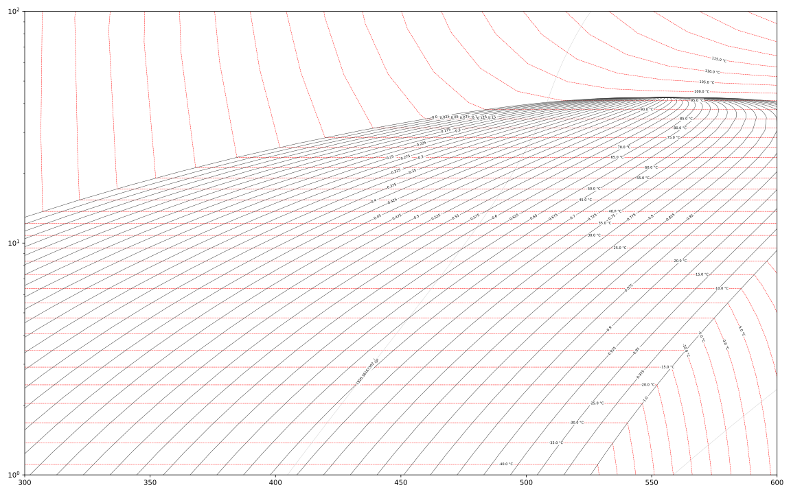

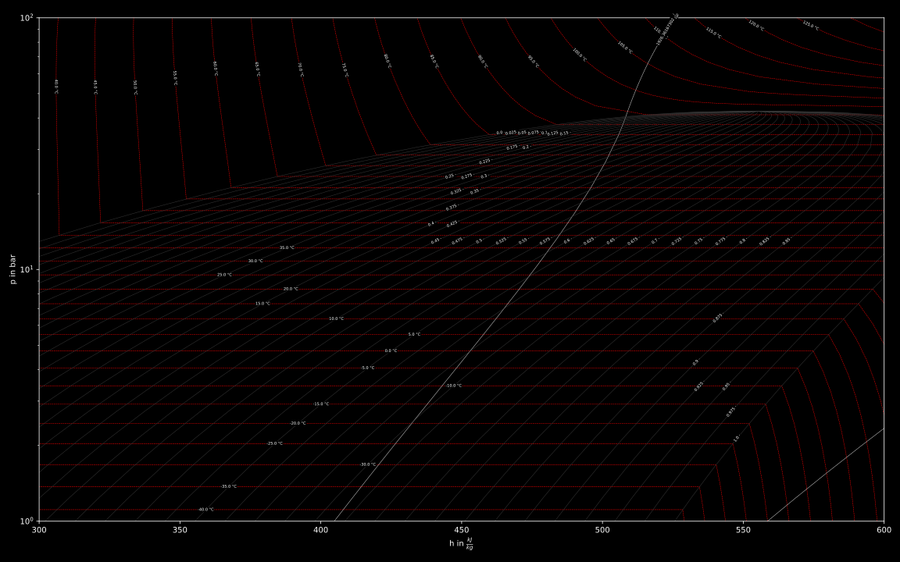

.. note::

    The placing method of the labels is not fully satisfactory at the moment.
    If you have ideas, how to place the labels in an improved way, we are
    looking forward for you suggestions.

Changing the line labels and LaTeX-style units
**********************************************
It is possible to add more than a single label to each isoline with key
:code:`labels_per_lin`, or to only add a label to each n-th isoline with key
:code:`label_every_nth`. We can also disable the LaTeX style unit display with
:code:`latex_units=False`.

.. code-block:: python

    >>> diagram.set_isolines_subcritical(-75, 125)  # also resets old isolines
    >>> diagram.calc_isolines()
    >>> fig, ax = plt.subplots(1, figsize=(16, 10))
    >>> mydata = {
    ...     'T': {
    ...         'style': {'color': '#ff0000'},
    ...         'label_every_nth': 2,  # every second line
    ...         'labels_per_line': 3  # 3 labels for every line
    ...     }
    ... }
    >>> diagram.draw_isolines(
    ...     fig, ax, 'logph', isoline_data=mydata,
    ...     x_min=0, x_max=750, y_min=1, y_max=5e1, latex_units=False
    ... )
    >>> plt.tight_layout()
    >>> fig.savefig('logph_R290_labeling.svg')

.. figure:: /reference/_images/logph_R290_labeling.svg
    :align: center
    :figclass: only-light

.. figure:: /reference/_images/logph_R290_labeling_darkmode.svg
    :align: center
    :figclass: only-dark

Plotting individual isolines (and isolike lines)
^^^^^^^^^^^^^^^^^^^^^^^^^^^^^^^^^^^^^^^^^^^^^^^^

FluProDia offers a method to generate data for individual isolines with a
specified starting and a specified ending point. Use the method
:py:meth:`fluprodia.fluid_property_diagram.FluidPropertyDiagram.calc_individual_isoline`
to create datapoints for the isoline. The method returns a dictionary
containing the datapoints in numpy arrays using the property name as
respective key. Therefore, independent of the diagram you want to draw, you
will have all data available. Following, we will draw all available isolines
into a Ts and a logph diagram. Each property value must be passed in the
diagram's respective unit system.

.. code-block:: python

    >>> data = {
    ...     'isobaric': {
    ...         'isoline_property': 'p',
    ...         'isoline_value': 10,
    ...         'starting_point_property': 'T',
    ...         'starting_point_value': -50,
    ...         'ending_point_property': 'T',
    ...         'ending_point_value': 150
    ...     },
    ...     'isochoric': {
    ...         'isoline_property': 'v',
    ...         'isoline_value': 0.035,
    ...         'starting_point_property': 'h',
    ...         'starting_point_value': 250,
    ...         'ending_point_property': 'T',
    ...         'ending_point_value': 125
    ...     },
    ...     'isothermal': {
    ...         'isoline_property': 'T',
    ...         'isoline_value': 50,
    ...         'starting_point_property': 'Q',
    ...         'starting_point_value': 0.1,
    ...         'ending_point_property': 'v',
    ...         'ending_point_value': 0.5
    ...     },
    ...     'isenthalpic': {
    ...         'isoline_property': 'h',
    ...         'isoline_value': 500,
    ...         'starting_point_property': 'p',
    ...         'starting_point_value': 95,
    ...         'ending_point_property': 'p',
    ...         'ending_point_value': 5
    ...     },
    ...     'isentropic': {
    ...         'isoline_property': 's',
    ...         'isoline_value': 2500,
    ...         'starting_point_property': 'p',
    ...         'starting_point_value': 1,
    ...         'ending_point_property': 'p',
    ...         'ending_point_value': 80
    ...     }
    ... }

    >>> for name, specs in data.items():
    ...    data[name]['datapoints'] = diagram.calc_individual_isoline(**specs)

With these data, it is possible to plot to your diagram simply by plotting on
the :code:`diagram.ax` object, which is a
:code:`matplotlib.axes._subplots.AxesSubplot` object. Therefore all matplolib
plotting functionalities are available. Simply pass the data of the x and y
property of your diagram, e.g. to the :code:`plot()` method.

.. code-block:: python

    >>> fig, ax = plt.subplots(1, figsize=(16, 10))
    >>> diagram.clear_isolines()  # we remove the old ones and make them new
    >>> diagram._setup_isoline_defaults()
    >>> iso_T = np.arange(-75, 151, 25)
    >>> diagram.set_isolines(T=iso_T)
    >>> diagram.calc_isolines()

    >>> diagram.draw_isolines(fig, ax, 'logph', isoline_data=mydata, x_min=0, x_max=1000, y_min=1e-1, y_max=1.5e2)
    >>> for key, specs in data.items():
    ...     datapoints = specs['datapoints']
    ...     _ = ax.plot(specs['datapoints']['h'], specs['datapoints']['p'], label=key)
    >>> _ = ax.legend(loc='lower right')
    >>> plt.tight_layout()
    >>> fig.savefig('logph_R290_isolines.svg')

    >>> fig, ax = plt.subplots(1, figsize=(16, 10))
    >>> diagram.draw_isolines(fig, ax, 'Ts', x_min=750, x_max=3000, y_min=-50, y_max=150)
    >>> for key, specs in data.items():
    ...     datapoints = specs['datapoints']
    ...     _ = ax.plot(specs['datapoints']['s'], specs['datapoints']['T'], label=key)
    >>> _ = ax.legend(loc='lower right')
    >>> plt.tight_layout()
    >>> fig.savefig('Ts_R290_isolines.svg')

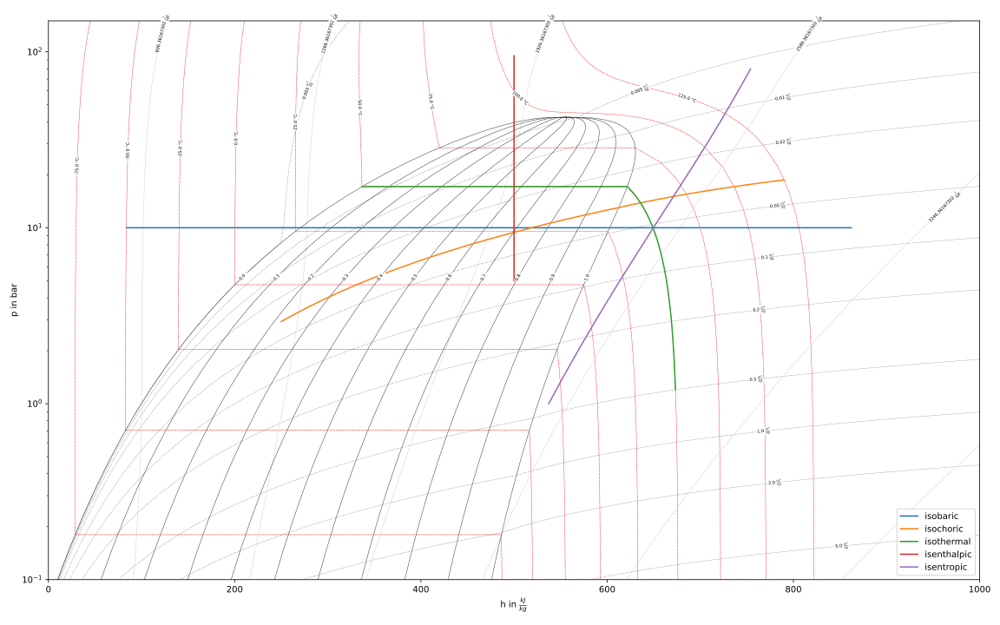

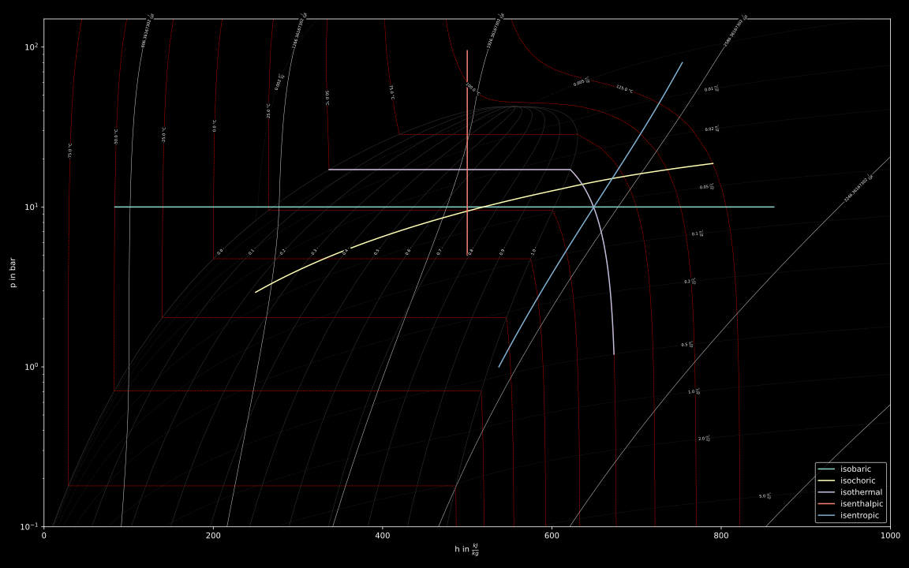

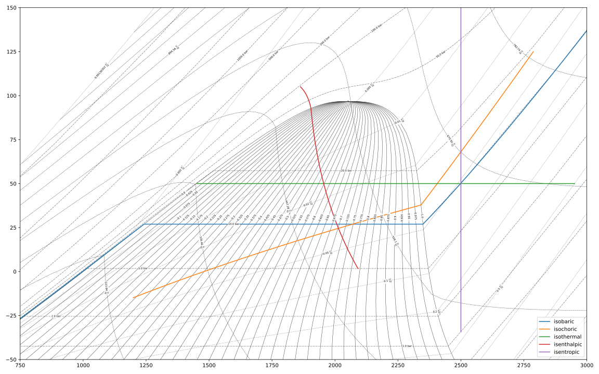

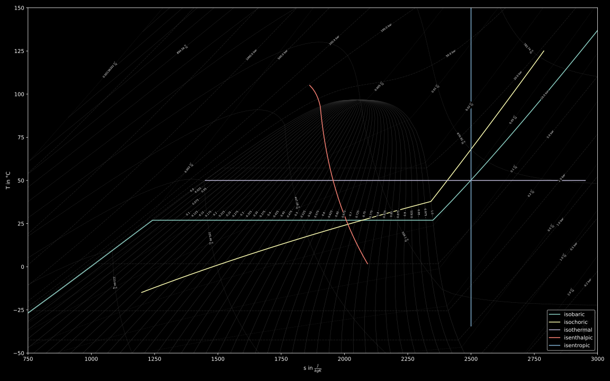

.. note::

    Note that the :code:`starting_point_property` and the
    :code:`ending_point_property` do not need to be identical! E.g., you can
    draw an isobaric line starting at a specific entropy and ending at a
    specific temperature.

On top of that, e.g. in order to display a pressure loss in a heat exchanger,
you can have different values for the (iso)line at the starting and the ending
points. The (then former) isoline property will be changed linearly to either
change in entropy (for isobars and isotherms) or change in pressure (for all
other lines). This functionality is only supposed to display the change in a
beautiful way, it does not represent the actual process connecting your
starting point with your ending point as this would require perfect knowledge
of the process. In order to generate these data, you need to pass the
:code:`'isoline_value_end'` keyword to the
:py:meth:`fluprodia.fluid_property_diagram.FluidPropertyDiagram.calc_individual_isoline`
method.

.. code-block:: python

    >>> data = {
    ...     'isoline_property': 'p',
    ...     'isoline_value': 10,
    ...     'isoline_value_end': 9,
    ...     'starting_point_property': 'Q',
    ...     'starting_point_value': 0,
    ...     'ending_point_property': 'h',
    ...     'ending_point_value': 750
    ... }
    >>> datapoints = diagram.calc_individual_isoline(**data)
    >>> diagram.draw_isolines(fig, ax, 'Ts', x_min=750, x_max=3000, y_min=-50, y_max=150)
    >>> for specs in data.values():
    ...    _ = ax.plot(datapoints['s'], datapoints['T'])
    >>> plt.tight_layout()
    >>> fig.savefig('Ts_R290_pressure_loss.svg')

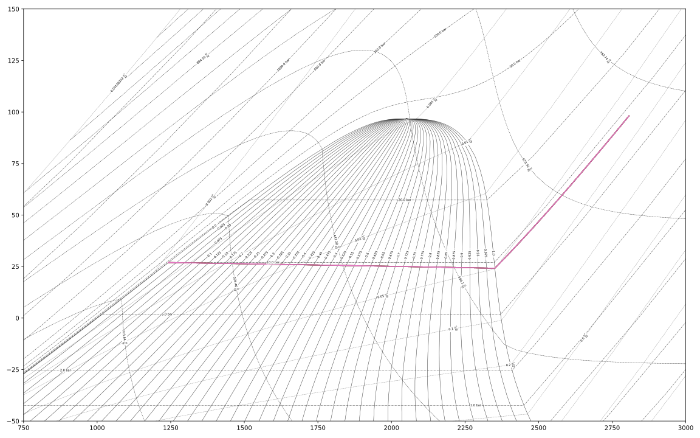

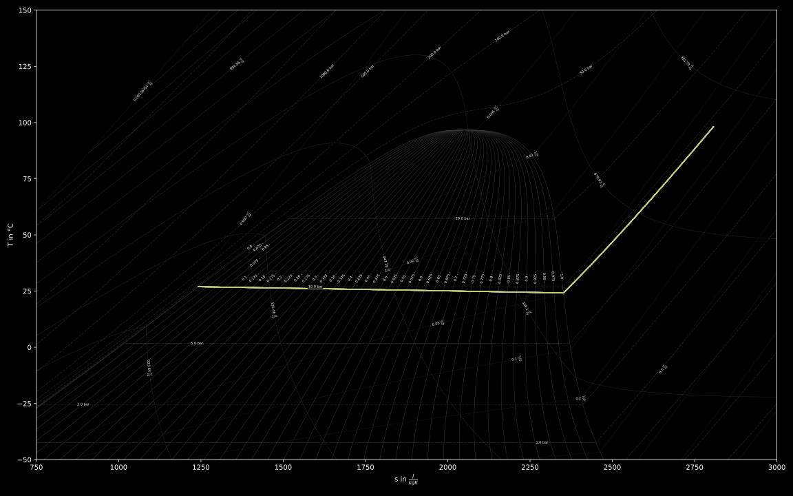

Plotting States into the Diagram
^^^^^^^^^^^^^^^^^^^^^^^^^^^^^^^^

For instance, if you want to plot two different states of :code:`R290` into your
diagram, you could use the :code:`scatter()` method. If you want to have
connected states, you will need the :code:`plot()` method. In this example, we
will plot from a simple heat pump simulation in TESPy [1]_ (for more
information on TESPy see the
`online documentation <https://tespy.readthedocs.io/>`_) into a logph
and a Ts diagram.

.. figure:: reference/_images/logph_diagram_states.svg
    :align: center
    :figclass: only-light

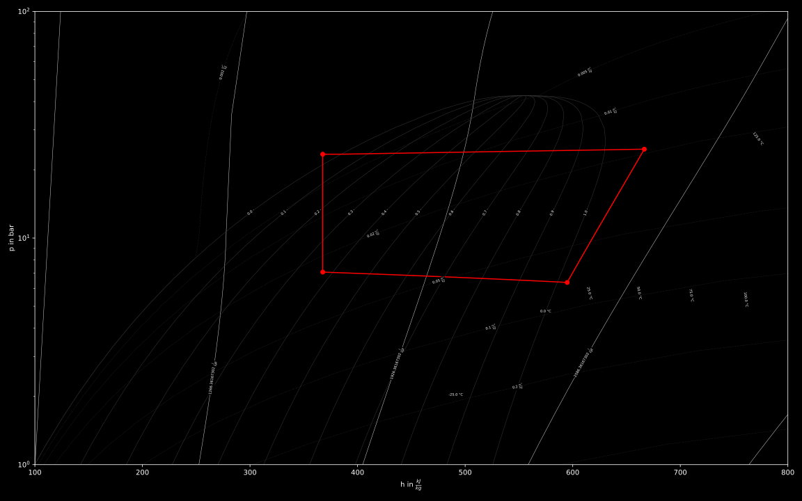

.. figure:: reference/_images/Ts_diagram_states.svg
    :align: center
    :figclass: only-light

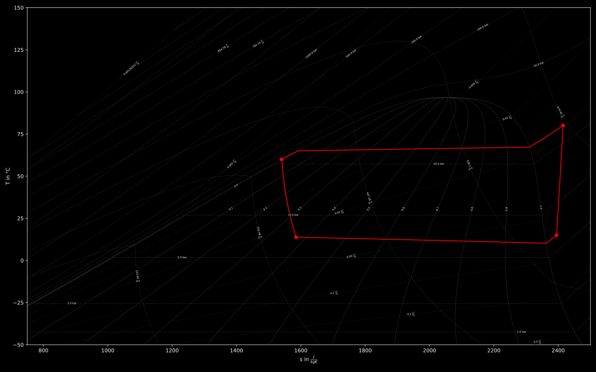

You can use the :code:`get_plotting_data` data method from the
:code:`tespy.tools` module to automatically extract all data for the specified
part of the model.

.. code-block:: python

    >>> from tespy.components import (
    ...     Compressor, CycleCloser, SimpleHeatExchanger, Valve
    ... )
    >>> from tespy.connections import Connection
    >>> from tespy.networks import Network
    >>> from tespy.tools import get_plotting_data

    >>> def run_simple_heat_pump_model():
    ...     nw = Network(iterinfo=False)
    ...     nw.units.set_defaults(
    ...         temperature="°C",
    ...         pressure="bar",
    ...         enthalpy="kJ/kg",
    ...         heat="kW",
    ...         power="kW"
    ...     )
    ...
    ...     cp = Compressor('compressor')
    ...     cc = CycleCloser('cycle_closer')
    ...     cd = SimpleHeatExchanger('condenser')
    ...     va = Valve('expansion valve')
    ...     ev = SimpleHeatExchanger('evaporator')
    ...
    ...     cc_cd = Connection(cc, 'out1', cd, 'in1', label='c1')
    ...     cd_va = Connection(cd, 'out1', va, 'in1', label='c2')
    ...     va_ev = Connection(va, 'out1', ev, 'in1', label='c3')
    ...     ev_cp = Connection(ev, 'out1', cp, 'in1', label='c4')
    ...     cp_cc = Connection(cp, 'out1', cc, 'in1', label='c5')
    ...
    ...     nw.add_conns(cc_cd, cd_va, va_ev, ev_cp, cp_cc)
    ...
    ...     cd.set_attr(pr=0.95, Q=-1e3)
    ...     ev.set_attr(pr=0.9)
    ...     cp.set_attr(eta_s=0.85)
    ...
    ...     cc_cd.set_attr(fluid={'R290': 1})
    ...     cd_va.set_attr(td_bubble=5, T=60)
    ...     ev_cp.set_attr(td_dew=5, T=15)
    ...     nw.solve('design')
    ...     return nw

.. code-block:: python

    >>> nw = run_simple_heat_pump_model()
    >>> processes, points = get_plotting_data(nw, "c1")
    >>> processes = {
    ...     key: diagram.calc_individual_isoline(**value)
    ...     for key, value in processes.items()
    ...     if value is not None
    ... }

    >>> fig, ax = plt.subplots(1, figsize=(16, 10))
    >>> mydata = {
    ...     'Q': {'values': np.linspace(0, 1, 11)},
    ...     'T': {
    ...         'values': np.arange(-25, 150, 25),
    ...         'style': {'color': '#000000'}
    ...     }
    ... }
    >>> diagram.set_isolines(T=mydata["T"]["values"], Q=mydata["Q"]["values"])
    >>> diagram.calc_isolines()
    >>> diagram.draw_isolines(
    ...     fig, ax, 'logph', isoline_data=mydata,
    ...     x_min=100, x_max=800, y_min=1e0, y_max=1e2
    ... )

    >>> for label, values in processes.items():
    ...     _ = ax.plot(values["h"], values["p"], label=label, color="tab:red")
    >>> for label, point in points.items():
    ...     _ = ax.scatter(point["h"], point["p"], label=label, color="tab:red")

    >>> plt.tight_layout()
    >>> fig.savefig('logph_diagram_states.svg')

    >>> fig, ax = plt.subplots(1, figsize=(16, 10))
    >>> diagram.draw_isolines(fig, ax, 'Ts', x_min=750, x_max=2500, y_min=-50, y_max=150)

    >>> for label, values in processes.items():
    ...     _ = ax.plot(values["s"], values["T"], label=label, color="tab:red")
    >>> for label, point in points.items():
    ...     _ = ax.scatter(point["s"], point["T"], label=label, color="tab:red")

    >>> plt.tight_layout()
    >>> fig.savefig('Ts_diagram_states.svg')

.. note::

    The values for plotting must be passed in the diagrams unit system.

Export the underlying data
^^^^^^^^^^^^^^^^^^^^^^^^^^^
You can export the underlying data in :code:`json` format:

.. code-block:: python

    >>> diagram.to_json("diagram.json")

Finally, you can also reload a diagram from the data:

.. code-block:: python

    >>> diagram = FluidPropertyDiagram.from_json("diagram.json")

.. [1] Witte, F.; Tuschy, I. (2020). TESPy: Thermal Engineering Systems in Python. Journal of Open Source Software, 5(49), 2178, https://doi.org/10.21105/joss.02178.
